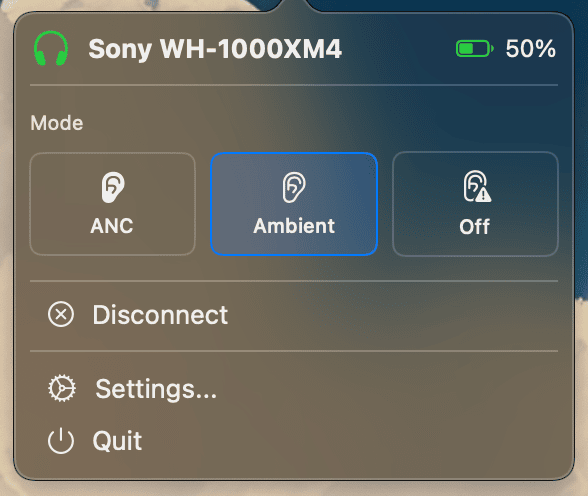

# XM4Control

A lightweight macOS menu bar app for controlling Sony WH-1000XM4 headphones.

## Features

- **Quick mode switching** - Toggle between Noise Cancelling, Ambient Sound, and Off modes
- **Right-click cycling** - Right-click the menu bar icon to cycle through modes
- **Battery monitoring** - View battery level
- **Auto-connect** - Optionally connect to your headphones when the app launches
- **Launch at login** - Start automatically when you log in

## Installation

### Download

Download the latest release from the [Releases](../../releases) page.

### Build from Source

1. Clone the repository
2. Open `XM4Control.xcodeproj` in Xcode
3. Build and run (Cmd+R)

Requires:
- macOS 14.0+
- Xcode 15+

## Setup

1. Pair your WH-1000XM4 headphones with your Mac via System Settings → Bluetooth
2. Open XM4Control settings and select your device
3. Click Connect

## Compatibility

This app communicates with Sony headphones using their proprietary Bluetooth RFCOMM protocol. It has been tested with:

- Sony WH-1000XM4

It may work with other Sony headphones that use the same protocol (XM3, XM5) but this is untested.

## Disclaimer

This is an unofficial application and is not affiliated with Sony. Use at your own risk. The author is not responsible for any consequences arising from the use of this software.

## License

[MIT](LICENSE)
